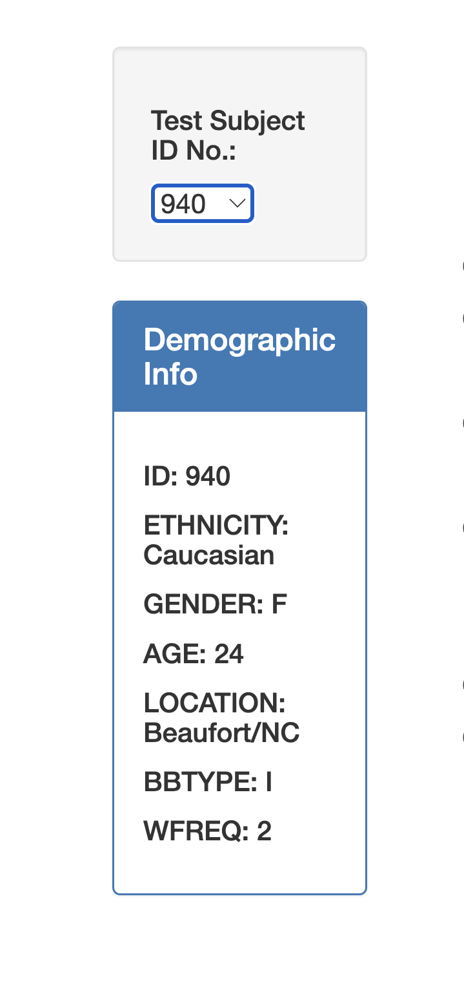
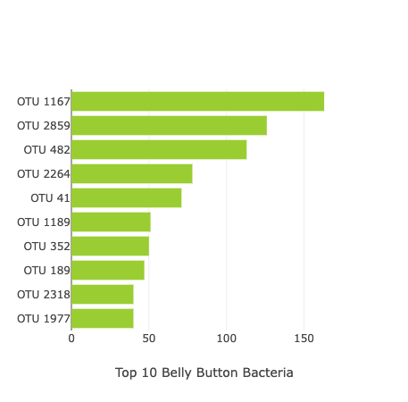
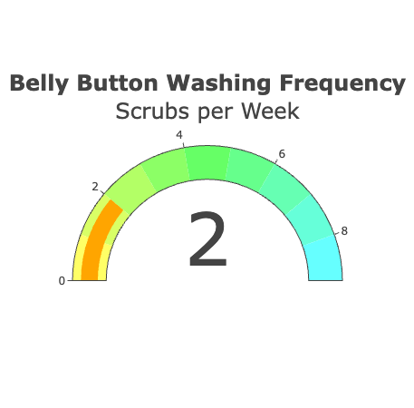
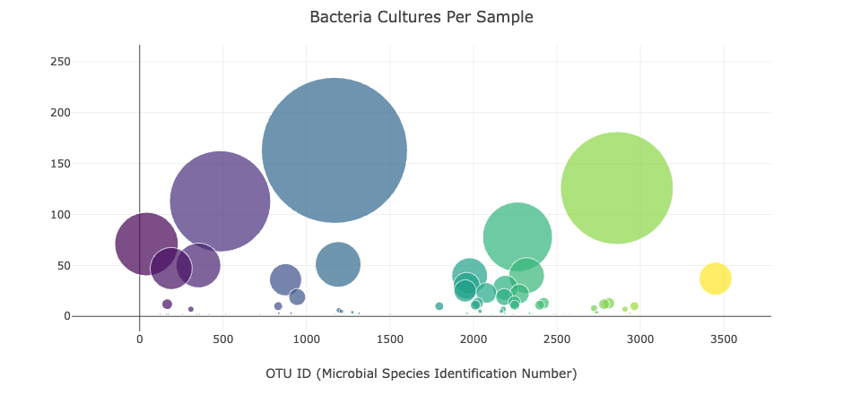

<h1> Belly Button Biodiversity Dashboard   (JavaScript and Plotly Demonstration)</h1>

## Background

The doal of this project buuld an interactive dashboard  using `JavaScript` and `Plotly.js` along with HTML to visualize how many microbes inhabit human navels.  Based on The data that is used by the program is contained in a JSON file provided by   <a href="http://robdunnlab.com/projects/belly-button-biodiversity"> The Belly Button Biodiversity Project </a>. 
## Perpuse
Interactive dashboard and charts display bacteria that live inside the human body. By selecting an id number in a drop down list, the id metadata will be displayed in a div element and the Top_10 bacterial samples will be displayed in a bar chart and bubble chart. 

## Deployed website:
[Click here to view the live project!](https://ib2ms.github.io/belly-button-challenge/).

## Using dashboard
Select an ID number from the dropdown menu to populate the demographic information and display visualizations.

Demographic Information

When an ID is chosen from the dropdown menu, will be a  person's demographic information, such as location, sex, and age.

##  Visualisation

### Top 10 Bacterial Species (OTUs)

When an ID is selected from the dropdown menu, wii be  Top 10 bacterial species (OTUs) are displayed in a horizontal bar chart:

### Belly Button Washing Frequency (Scrubs per week)

When an ID is selected from the dropdown menu, will be a person's weekly washing frequency is displayed as a measure from 0-9 in a gauge chart:

### Bacteria Cultures Per Sample

When an ID is selected from the dropdown menu, will be a  person's bacteria culture per sample (otu_ids as x-axis & sample_values as y-axis) is displayed as a bubble chart:

